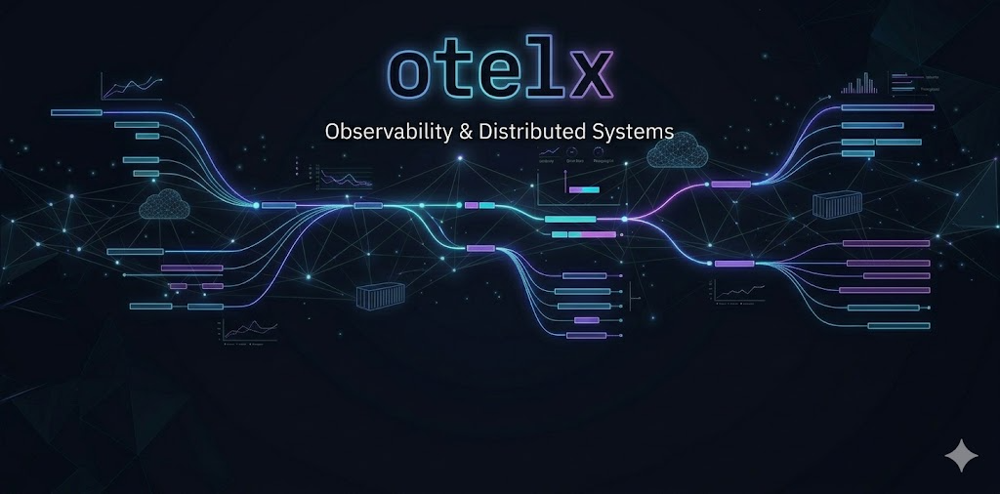

<p align="center">
  
</p>

<h1 align="center">OpenTelemetry Learning Lab</h1>

<p align="center">
  <a href="https://opentelemetry.io/"></a>
  <a href="https://nodejs.org/"></a>
  <a href="./user-service/docker-compose.yml"></a>
  
  
</p>

A hands-on repository to learn **OpenTelemetry** with practical examples: manual/automatic instrumentation, Tempo integration, and a sample user-service setup.

---

## Table of Contents

- [Overview](#overview)
- [Repository Structure](#repository-structure)
- [Prerequisites](#prerequisites)
- [Quick Start](#quick-start)
- [Projects](#projects)
  - [1) Docs](#1-docs)
  - [2) Automatic Instrumentation](#2-automatic-instrumentation)
  - [3) Grafana Tempo Demo](#3-grafana-tempo-demo)
  - [4) User Service](#4-user-service)
- [Learning Path](#learning-path)
- [Contributing](#contributing)
- [License](#license)

---

## Overview

This repo is focused on learning OpenTelemetry end-to-end:
- Generating traces from Node.js apps
- Auto and manual instrumentation patterns
- Exporting telemetry and visualizing traces with Tempo/Grafana
- Running service + observability stack locally with Docker

## Repository Structure

```text
.
├── docs/
├── Automatic-Instrumentation/
├── grafana-tempo/
├── user-service/
├── image.png
└── README.md
```

## Prerequisites

- Node.js 18+
- npm
- Docker & Docker Compose
- Basic understanding of APIs/services

## Quick Start

```bash
# clone
git clone <your-repo-url>
cd open-telemetry

# pick any module and run it
cd Automatic-Instrumentation
npm install
npm start
```

## Projects

### 1) Docs
- Intro notes: [`docs/1-intoduction-to-opentelemetry.md`](./docs/1-intoduction-to-opentelemetry.md)

### 2) Automatic Instrumentation
- Folder: [`Automatic-Instrumentation`](./Automatic-Instrumentation)
- Includes examples for auto instrumentation and logging traces.
- Start point: [`Automatic-Instrumentation/README.md`](./Automatic-Instrumentation/README.md)

### 3) Grafana Tempo Demo
- Folder: [`grafana-tempo`](./grafana-tempo)
- Contains Docker + Tempo configuration and tracing example.
- Main files:
  - [`grafana-tempo/docker-compose.yaml`](./grafana-tempo/docker-compose.yaml)
  - [`grafana-tempo/readme.md`](./grafana-tempo/readme.md)

### 4) User Service
- Folder: [`user-service`](./user-service)
- A sample service with OpenTelemetry setup and containerization.
- Start point: [`user-service/README.md`](./user-service/README.md)

## Learning Path

1. Read the intro docs
2. Run `Automatic-Instrumentation` examples
3. Bring up `grafana-tempo` stack
4. Run `user-service` and inspect traces

## Contributing

PRs and improvements are welcome—especially around:
- Better instrumentation examples
- Additional exporters/backends
- Clearer tutorials and diagrams

## License

MIT (update this section if your project uses a different license).
