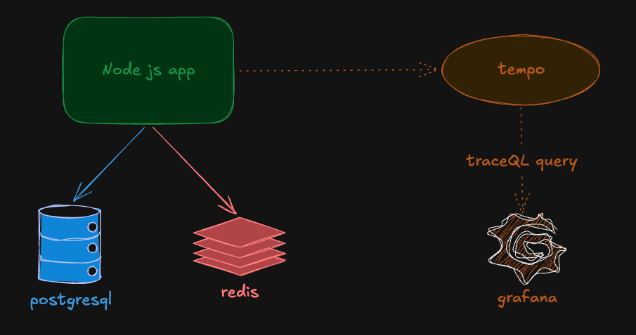
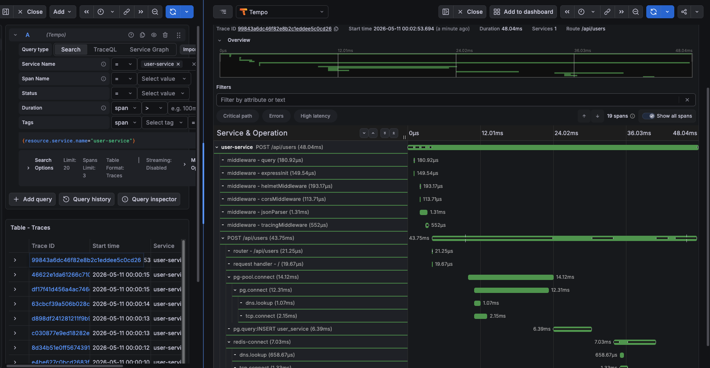

# User Service with OpenTelemetry Observability

A Node.js/Express CRUD service instrumented with **OpenTelemetry** for end-to-end observability.  
This project demonstrates distributed tracing, request/database metrics, structured logs, and Grafana + Tempo visualization.

---

## Table of Contents

- [Overview](#overview)
- [Architecture](#architecture)
- [Observability Stack](#observability-stack)
- [Tracing Implementation](#tracing-implementation)
- [Metrics Implemented](#metrics-implemented)
- [Dashboards & Trace View](#dashboards--trace-view)
- [Run Locally](#run-locally)
- [Key Endpoints](#key-endpoints)
- [Troubleshooting](#troubleshooting)

---

## Overview

This service manages users (`create`, `read`, `update`, `delete`, `list`) and sends telemetry signals for each request:

- **Traces**: request lifecycle + operation spans
- **Metrics**: HTTP latency/count + DB query metrics + user activity metrics
- **Logs**: contextual app logs for success/error paths

The goal is to make system behavior observable and debuggable under real workloads.

---

## Architecture

- **App**: Node.js + Express
- **Database**: PostgreSQL
- **Cache**: Redis
- **Tracing Backend**: Tempo
- **Visualization**: Grafana

Telemetry flow:

1. Request enters Express middleware
2. Span starts (`startActiveSpan`)
3. Controller/service/repository operations execute
4. Metrics are recorded (duration, counters)
5. Span closes when response ends
6. Traces exported to Tempo and queried from Grafana

---

## Observability Stack

### OpenTelemetry SDK (`src/tracing.js`)

Configured SDK components:

- `NodeSDK`
- `OTLPTraceExporter` (gRPC -> Tempo)
- Auto-instrumentations:
  - Express
  - PostgreSQL
  - Redis
  - gRPC

### Custom Request Tracing Middleware (`src/middlewares/tracing.js`)

Adds custom spans per HTTP request and enriches spans with semantic attributes:

- `http.method`
- `http.route`
- `http.url`
- `http.host`
- `http.status_code`

Also records request-level metrics when response finishes.

### Controller-level Telemetry (`src/controllers/userController.js`)

Each handler adds:

- span events (e.g., user creation started/completed)
- status + exception recording on failure
- DB-related and business metrics (success/failure, active users)

---

## Tracing Implementation

Trace enrichment includes:

- Request metadata
- User identifiers (where applicable)
- Domain events
- Error status and captured exception details

This gives enough context to answer:

- Which endpoint is slow?
- Which DB operation is failing?
- Which request produced a 5xx?
- Which user flow produced errors?

---

## Metrics Implemented

### HTTP Metrics

- `http_requests_total` (Counter)
- `http_request_duration_seconds` (Histogram)

### Database Metrics

- `db_queries_total` (Counter)
- `db_query_duration_seconds` (Histogram)

### Business Metrics

- `users_created_total` (Counter, with success/failure labels)
- `active_users` (UpDownCounter)

---

## Dashboards & Trace View

### Service Dashboard / Observability View



### Grafana Tempo Trace Exploration



---

## Run Locally

### 1) Start the stack

```bash
docker compose up -d --build
```

Services:

- App: `http://localhost:3000`
- Grafana: `http://localhost:3001`
- Tempo API: `http://localhost:3200`

### 2) Generate traffic

Use cURL/Postman against user endpoints (see below) to produce traces and metrics.

### 3) Open Grafana

- Visit `http://localhost:3001`
- Open Explore / Tempo datasource
- Query traces for service name: `user-service`

---

## Key Endpoints

Base path: `/api/users`

- `POST /api/users` - Create user
- `GET /api/users/:id` - Get user by id
- `PUT /api/users/:id` - Update user
- `DELETE /api/users/:id` - Delete user
- `GET /api/users` - List all users

---

## Troubleshooting

### Grafana says: "Failed to connect to Tempo"

Check:

1. Correct Tempo config mount in `docker-compose.yml`:
   - `./tempo/tempo.yaml:/etc/tempo/tempo.yaml`
2. Tempo container is healthy:
   ```bash
   docker compose logs -f tempo
   ```
3. Grafana datasource URL is:
   - `http://tempo:3200`

### No traces visible

- Ensure requests are hitting app endpoints
- Confirm trace exporter endpoint is reachable from app container
- Check app logs for OpenTelemetry exporter errors

---

## Notes

This project is designed as a practical observability lab: easy to run, inspect, and extend with alerts, SLOs, and additional telemetry backends.
